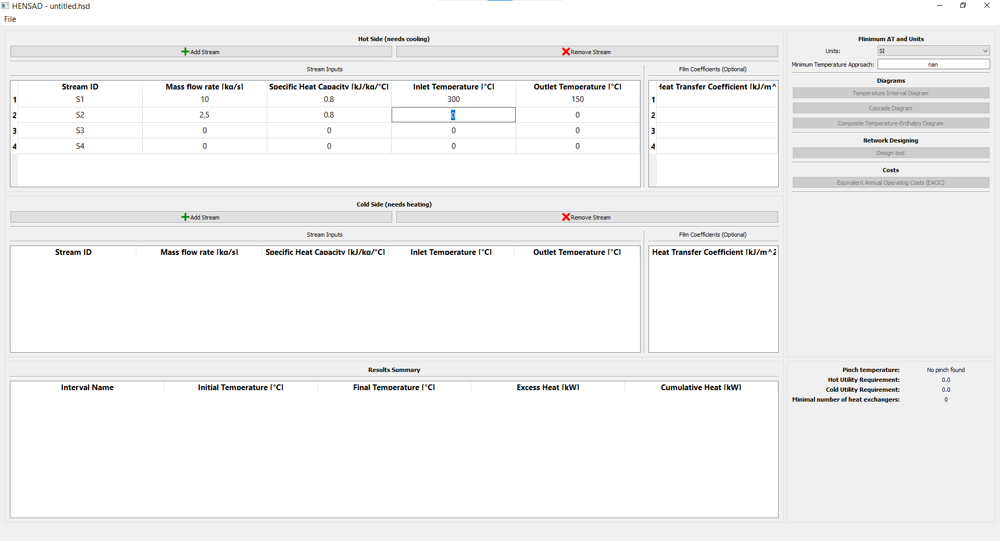

# HENSAD
This HENSAD (*H*eat-*E*xchanger *N*etwork *S*ynthesis *A*nalysis and *D*esign) software implementation is nothing more than a "port" of the [previous version](https://richardturton.faculty.wvu.edu/publications/analysis-synthesis-and-design-of-chemical-processes-5th-edition) developed by Dr. Turton at West Virginia University.

## Why the update if there is already a working software?
Well, I have used the first version of the sofware, and even though it works just fine, it does not have the best user experience to it (due the year it was developed in 2001).

This is just an update, made by me, to the user experience of the previous software with minor enhancements (e.g. I have included the Heat-Exchanger Network cost calculations using the updated procedures from the same book, etc.), and a minor bug correction in the EAOC calculation. Everything else, is basically the same with a new GUI.

Also, there is a pure python package module under the [src folder](https://github.com/feslima/HENSAD/tree/master/src/hensad) that can be used by anyone who knows the basics of Python, NumPy and Pandas in more "bare" calculations.

# Installation
There are two ways of installation:

1. Download the binaries from the [releases page](https://github.com/feslima/HENSAD/releases) and run the application. Simple as that. No need to install python or any other package. **This is Windows OS only though.**

1. For those who know their way around Python and its packages: 
    1. clone the repository to your machine;
    1. create a python virtual environment of your choice;
    1. install the dependencies through the `pip install -r requirements.txt` command; 
    
    From now on, you can:
    1. Simply import/copy the `hensad` module under the *src* folder to use the HENSAD functions programmatically in your calculations;
    2. Initialize the GUI by running the command `python path/to/mainwindow.py`. The `mainwindow.py` file is located under the *gui* folder in the *src* directory.

# GUI Usage
We are going to redo the example from the Chapter 15 on Pinch technology of the [Analysis, Synthesis and Design of Chemical Processes book](https://scholar.google.com.br/scholar?q=analysis+synthesis+and+design+of+chemical+processes).

1. We start by filling the thermal data from the process streams on both hot and cold sides.

    

    As soon the data is filled and a minimum temperature approach is chosen you will see the results summary at the bottom table with the amount of intervals and the enthalpy transfer quantities between the intervals. On the right of the results table you can see pinch intervals, its values, if there are any, and the minimum number of heat exchangers needed.

    **If you want to know the heat exchanger network (HEN) areas, you will need to input the heat transfer coefficient data aswell.**

    

    On the top right you can choose the units, and which information/graph you wish to extract from the stream data you supplied.

    

1. **Temperature interval diagram**: just press the button and a new dialog will pop up on your screen.

    

    The slider at the top of the dialog is linked to the minimum temperature approach value. If you wish to see different temperature interval scenarios, you simply need to move the slider.

1. **Cascade diagram**: same thing as the temperature interval diagram. Press the button. Same logic applies to the slider in the dialog.

    

1. **Design above and below pinch interval**:
    In order to design your heat-exchanger networks above and below pinch you will need the heat transfer coefficient data of the streams. Then you can click on the "Design Tool" button. This will open another dialog.

    In this dialog you can add either process or utility heat-exchangers. 
    To add a process stream heat-exchanger you have to click and hold on a 
    "source" stream and drag the mouse to the "destination" stream. 
    
    
    
    After this, you will be prompted to enter the heat-exchanger data required.

    

    

    If everything goes accordingly, this will be the result:

    

    The end result of adding all the process heat-exchangers above the pinch will look like this:

    

    When adding an utility heat exchanger, you have to right-click which stream you want to insert the equipment.

    

    Then you fill the equipment data form:

    

    The end result for the network above the pinch will look like this:

    

    **Design below the pinch:**

    Since you need to split a cold stream, you must right-click the stream and "split". A new dialog will pop up asking you the number of streams to split into and the mass flowrate for each split:

    

    

    

    The we proceed the same way as the design above the pinch:

    **Here we change the type of heat exchanger to Double pipe with conventional tube arrangement!**

    

    This is the final design for above and below the pinch:
    
    

1. **The composite temperature-enthalpy diagram**:
    Same thing as the cascade and temperature interval diagrams. Press the button and change the slider.

    

1. **Equivalent annual operating cost (EAOC)**:
    Here you simply provide the minimum temperature approach range and the type of heat-exchanger parameters. Then you plot the EAOC and heat-exchanger network area curves.

    

# Contributions and status

Right now I can't keep maintaining this project due time constraints. However feel free to open issues, pull request or any comment kind of feedback. I will try to respond as soons as I can. :)